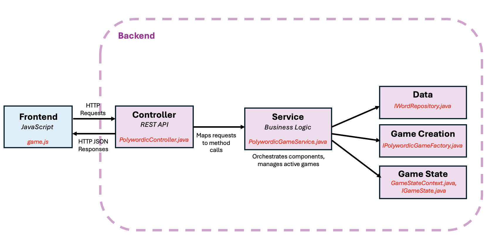
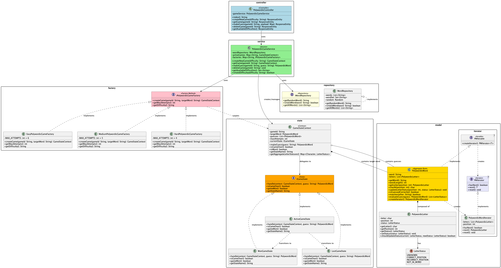

# Polywordic

A Wordle-inspired Java web application built using **Spring Boot**, **Thymeleaf**, and **Gradle**.

---

## Team Members

- Katherine Deegan
- Yifei Zhang

---

## Project Description

**Polywordic** is a Wordle-style word-guessing game built with Java Spring Boot and JavaScript. Players have a limited number of attempts (based on difficulty level) to guess a 5-letter word, receiving color-coded feedback after each guess. This project demonstrates multiple object-oriented design patterns; specifically the MVC, Iterator, State, Factory, and Facade patterns. The implementation details for each of these patterns is described below.

### High-Level Architecture

### Class Diagram

---

## Object-Oriented Design Patterns Used

### 1. Model-View-Controller (MVC)

_Description:_

The MVC pattern separates the application into three interconnected components, each with distinct responsibilities.

The **Model** layer includes the application's data, business logic, and domain rules. In the case of Polywordic, this includes defining a `PolywordicWord` class which defines a unique object type for target word in the game. `PolywordicWord` is composed of `PolywordicLetter` objects, each of which has a unique `LetterStatus` which is read and updated as the player plays the game.

The **View** layer can also be referred to as the _Presentation_ layer, and is responsible for displaying data to the user and capturing user input. In the case of Polywordic, this includes the components responsible for rendering the UI (HTML, CSS) and making HTTP requests to the Controller based on user interactions (JavaScript).

The **Controller** layer acts as intermediary between the View and Model. This layer is responsible for handling HTTP requests, validating input, delegating to Service, and returning responses.

_Implementation:_

- Model file(s): [`polywordic/model`](src/main/java/com/ooad_kd_yz/polywordic/model)
- View file(s): [`resources/templates`](src/main/resources/templates)
- Controller file(s): [`polywordic/controller`](src/main/java/com/ooad_kd_yz/polywordic/controller)

### 2. Iterator

_Description:_

Provides a way to access the elements of an aggregate object sequentially without exposing its underlying representation by implementing Iterator and Iterable interfaces.

_Implementation:_

- Iterator Interface: [`polywordic/interface/PWIterator.java`](src/main/java/com/ooad_kd_yz/polywordic/model/iterator/PWIterator.java)
  - The concrete iterator object [**PolywordicWordIterator**](src/main/java/com/ooad_kd_yz/polywordic/model/iterator/PolywordicWordIterator.java) implements the **PWIterator interface**.
- Iterable Interface: [`polywordic/interface/PWIterable.java`](src/main/java/com/ooad_kd_yz/polywordic/model/iterator/PWIterable.java)
  - The aggregate object [**PolywordicWord**](src/main/java/com/ooad_kd_yz/polywordic/model/PolywordicWord.java) (composed of [**PolywordicLetter**](src/main/java/com/ooad_kd_yz/polywordic/model/PolywordicLetter.java) objects) and implements the **PWIterable** interface.
    |

### 3. State

_Description:_

This pattern enables an object to alter its behavior in response to internal state changes, making it appear as if the object has changed classes.
To accomplish this, a **Context** object maintains an instance of a **State** object. The **State** object encapsulates behaviors linked to various conditions.
In the case of Polywordic, the State objects encapsulate the handling of a player's word guess, which changes based on if the game is in an Active or Over (Won or Lost) state.

_Implementation:_

- Context: [`polywordic/state/GameStateContext.java`](src/main/java/com/ooad_kd_yz/polywordic/state/GameStateContext.java)
- State Interface: [`polywordic/state/IGameState.java`](src/main/java/com/ooad_kd_yz/polywordic/state/IGameState.java)
- Concrete States: [`ActiveGameState.java`](src/main/java/com/ooad_kd_yz/polywordic/state/ActiveGameState.java), [`WonGameState.java`](src/main/java/com/ooad_kd_yz/polywordic/state/WonGameState.java), [`LostGameState.java`](src/main/java/com/ooad_kd_yz/polywordic/state/LostGameState.java)

### 4. Factory Method

_Description:_

Factories provide a way to encapsulate the instantiation of concrete types.
The Factory Method Pattern defines an interface for creating a product (in this case, an instance of [`GameStateContext.java`](src/main/java/com/ooad_kd_yz/polywordic/state/GameStateContext.java), or new game of Polywordic).
It then defers the actual instantiation of this product to its subclasses.

_Implementation:_

- Creator interface: [`IPolywordicGameFactory.java`](src/main/java/com/ooad_kd_yz/polywordic/factory/IPolywordicGameFactory.java)
  - Defines the methods that concrete factories mus implement, including the Factory Method [`createGame()`]
- Concrete Creators: [`EasyPolywordicGameFactory.java`](src/main/java/com/ooad_kd_yz/polywordic/factory/EasyPolywordicGameFactory.java), [`MediumPolywordicGameFactory.java`](src/main/java/com/ooad_kd_yz/polywordic/factory/MediumPolywordicGameFactory.java), [`HardPolywordicGameFactory.java`](src/main/java/com/ooad_kd_yz/polywordic/factory/HardPolywordicGameFactory.java)
  - Create instances of Polywordic game with varying levels of difficulty (by varying number of `MAX_ATTEMPTS`).
- Product class: [`GameStateContext.java`](src/main/java/com/ooad_kd_yz/polywordic/state/GameStateContext.java)
- Client: [`PolywordicGameService.java`](src/main/java/com/ooad_kd_yz/polywordic/service/PolywordicGameService.java)
  - Maintains a reference to a IPolywordicGameFactory objects, and calls the Factory Method to create a game of the desired difficulty level.

### 5. Facade

_Description:_

The Facade Pattern provides a higher-level interface to a complex subsystem, making that subsystem easier to use.
In the case of Polywordic, we define a Service layer that contains the business logic related to playing a game of Polywordic
(i.e. creating a game of a desired difficulty with a target word, managing multiple instances of Active games, handling a user's word guess, and deleting games).
This Facade interface accomplishes this by maintaining reference to all the components required to play a game of Polywordic (IWordRepository, GameStateContext(s), IPolywordicGameFactories).

_Implementation:_

- Facade: [`PolywordicGameService.java`](src/main/java/com/ooad_kd_yz/polywordic/service/PolywordicGameService.java)

---

### Run Polywordic Locally

From terminal (in polywordic/ directory) run: `./gradlew bootRun`

**OR**, from the file navigator, run: [PolywordicApplication.java](src/main/java/com/ooad_kd_yz/polywordic/PolywordicApplication.java)

Then, navigate to `http://localhost:8080` in your browser.
